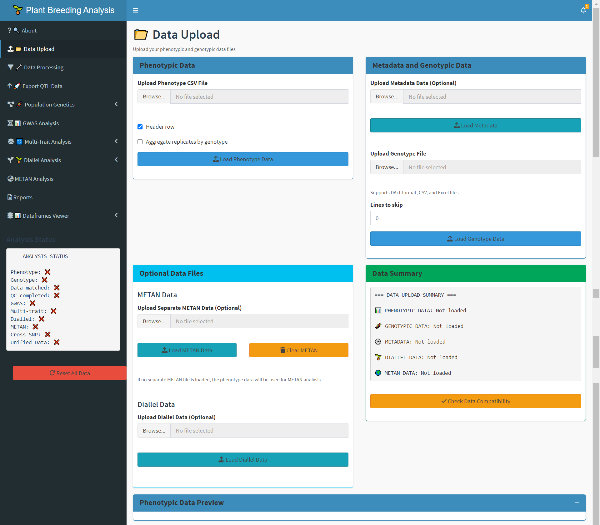

# 🌱 Plant Breeding Analysis Platform

## 📖 Overview
A comprehensive R/Shiny application for plant breeding data analysis, featuring genome-wide association studies (GWAS), diallel analysis, multi-environment trial analysis (METAN), and advanced population genetics tools. This platform provides an intuitive interface for breeders and geneticists to analyze complex breeding data without extensive programming knowledge.

## ✨ Key Features
  📊 Core Analysis Modules
  🧬 GWAS Analysis: Single-trait and multi-trait genome-wide association studies

  🌱 Diallel Analysis: Complete diallel analysis with GCA/SCA effects, heterosis, and cross performance

  🌍 METAN Analysis: Multi-environment trial analysis with AMMI, GGE biplot, and stability analysis

  🔬 Population Genetics: PCA, kinship, Fst-Fis, LEA structure, and allele frequency analysis

  🔧 Data Processing

  📁 Data Upload: Support for multiple file formats (CSV, Excel, DArT)

  🔧 Quality Control: MAF filtering, call rate thresholds, missing data imputation
 
  🔗 Data Matching: Automatic genotype-phenotype matching

## 📈 Advanced Analytics
  🔄 Multi-Trait Analysis: Combined P-values, meta-analysis, and pleiotropy detection

  🔗 Cross-SNP Mapping: Integration of diallel crosses with SNP effects

  🌐 Parent Network Analysis: Visualization of parent relationships and genetic networks

## 📋 Data Management
  📊 DataFrames Viewer: Interactive exploration of all generated dataframes

  🚀 Export Functions: Multiple export formats (CSV, Excel, RData, JSON)

  📄 Report Generation: Automated report generation in HTML, PDF, or Word formats

## 🚀 Installation
  Prerequisites
  R (version 4.0 or higher)

  RStudio (recommended)

  Required R packages (see below)

## Required R Packages
### Core packages
install.packages(c("shiny", "shinydashboard", "shinyWidgets", "DT", "plotly",
                   "ggplot2", "dplyr", "tidyr", "readr", "writexl", "jsonlite"))

### Analysis packages
install.packages(c("sommer", "metan", "AGHmatrix", "LEA", "adegenet", "hierfstat",
                   "rrBLUP", "qtl", "gplots", "RColorBrewer"))

### Optional but recommended
install.packages(c("visNetwork", "corrplot", "factoextra", "ggrepel", "reshape2"))
### Installation from Source

Clone or download the repository
Then run in R:
shiny::runApp("path/to/app/directory")

## 📁 Data Requirements
  Phenotypic Data: CSV, Excel, or text format

  Should include genotype IDs and trait measurements

  Optional: Environment, replication, and block information

### Genotypic Data
  DArT format, CSV, or Excel files

  SNP matrix with genotypes as rows and markers as columns

### Optional metadata columns

### Diallel Data
  Cross information (Parent1 × Parent2)

  Trait measurements for each cross

  Optional: Replication and environment data

### METAN Data
  Multi-environment trial data

  Environment, genotype, replication, and trait columns

## 🔍 User Interface Guide
### Main Navigation
🔍 About: Documentation and help files

📁 Data Upload: Upload and preview all data types

🔧 Data Processing: Quality control and data preparation

🧬 Population Genetics: Diverse genetic analysis tools

📊 GWAS Analysis: Single and multi-trait association studies

🌱 Diallel Analysis: Complete diallel breeding analysis

🌍 METAN Analysis: Multi-environment trial analysis

📋 DataFrames Viewer: Explore all generated data

### Analysis Workflow
  Upload Data → Process Data → Run Analyses → Export Results

### ⚙️ Configuration Options

### Quality Control Settings
  Call rate threshold (0.5-1.0)

  Minor Allele Frequency (MAF) cutoff

  Missing data thresholds

  Heterozygosity filters

### Analysis Parameters
  GWAS models (LM, LMM)

  PCA components (2-20)

  Kinship matrix methods

  Diallel analysis types

### 📊 Output and Results
  Export Formats: CSV/Excel tables

  RData for further analysis

  JSON for web applications

  PDF/HTML reports

### Visualizations
  Manhattan plots and QQ-plots

  Heatmaps and correlation matrices

  Network graphs and biplots

  Interactive plots with plotly

## 🛠️ Technical Details
### Architecture
  Modular design with separate analysis modules

  Reactive programming for real-time updates

  Caching system for improved performance

  Error handling and user feedback

### Performance Features
  Progress indicators for long-running analyses

  Data validation and error checking

  Memory-efficient data handling

  Parallel processing support for intensive computations

### 🤝 Contributing
  We welcome contributions! Please see our contributing guidelines for details on:

  Bug reports and feature requests

  Code contributions

  Documentation improvements

  Testing and quality assurance

## 📄 License
  This project is licensed under the MIT License - see the LICENSE file for details.

## 👥 Authors and Acknowledgments
### Primary Developer
  Kiplagat John Noel - Microbiology, Biochemistry and Biotechnology Department, Kenyatta University (KE)

### Acknowledgments
  R community for open-source packages

  Plant breeding research groups for testing and feedback

  Open-source software contributors

### 🔗 Useful Links
  R Project

  Shiny Documentation

  METAN Package

  Plant Breeding Resources

### 📞 Support and Contact
  For issues, questions, or suggestions:

  Check the documentation in the "About" tab

  Review the help files included with the application

  Contact the development team through the provided channels

  *Built with R/Shiny | For Plant Breeding Research*

